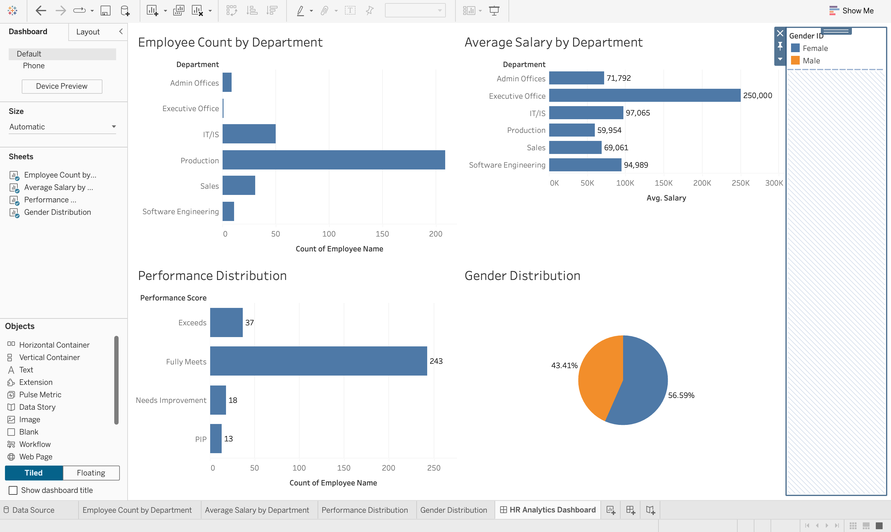

# HR Analytics Dashboard (Tableau) 

This project analyzes employee data to understand workforce distribution, salary patterns, and performance insights.

## Tools Used
- Tableau
- Excel

## Dashboard Insights
• Employee count by department  
• Average salary comparison across departments  
• Performance score distribution  
• Gender distribution in the organization

## Dashboard Preview

