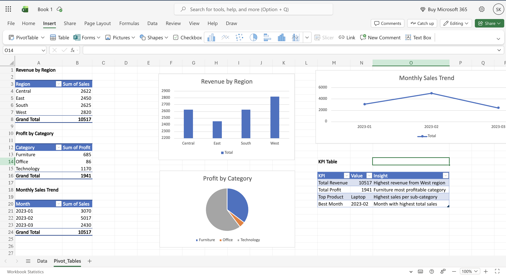

# Shriya – Data Analytics Portfolio

Welcome to my Data Analytics project portfolio.  
These projects demonstrate my skills in Excel, SQL, and Tableau for analyzing real-world datasets and building dashboards.

---

## 📊 Project 1: Sales Analysis (Excel + SQL)

This project analyzes sales performance using Excel Pivot Tables and SQL queries.

Key insights:
• Revenue trends by month  
• Profit analysis by category  
• Regional sales comparison  

Tools Used:
Excel, SQL

Screenshot:

---

## 📊 Project 2: HR Analytics Dashboard (Tableau)

This Tableau dashboard analyzes employee data to understand workforce distribution, salaries, and performance.

Key insights:
• Employee distribution across departments  
• Average salary comparison  
• Gender distribution  
• Performance score breakdown  

Tools Used:
Tableau

Screenshot:

---

## Skills Demonstrated

• Data Cleaning  
• Data Analysis  
• Dashboard Design  
• Business Insights  
• Data Visualization

Tools: Excel | SQL | Tableau
